#

[]{.linea-superior} 
[]{.linea-inferior} 

<!---
   
--->

  

[**Monitoreo de Modelos de Clasificación de Texto**]{.big-par .center-justified}
[**Ciencia de Datos**]{.medium-par.center-justified}

[**Agosto 2025**]{.big-par .center-justified}

## [Contenidos]{.big-par}  

<!-- ::: {.incremental} -->

- Motivación hacia el Monitoreo

- Data drift

- Arquitectura implementada

  - Esquema General

  - Model training 

  - Model prediction

  - Model monitoring

<!-- - Conclusión -->
<!-- ::: -->

## [Motivación hacia el Monitoreo I]{.big-par}

::: {.incremental .medium-par}
- **La Encuesta Nacional de Empleo (ENE)** genera mes a mes glosas abiertas que deben ser clasificadas y que dan cuenta de las ocupaciones y actividad económica del mercado laboral del país. 
- En su flujo de procesamiento, analistas de la ENE utilizan **codificación automática** para clasificar la ocupación (CIUO) y la rama de actividad económica (CAENES) de las personas, al nivel de desagregación de 1 y 2 dígitos.
- Cuatro **modelos de machine learning** han sido disponibilizados desde Ciencia de Datos para colaborar en esta tarea: 
  - **Modelo CIUO a 1 y 2 dígitos.**
  - **Modelo CAENES a 1 y 2 dígitos.**
- Además de la ENE, otras instituciones públicas también usan estos modelos (MDSF, ChileCompra, DT, FNE).
:::

## [Motivación hacia el Monitoreo II]{.big-par}

::: {.incremental .medium-par}
- **Los modelos de machine learning se degradan con el tiempo**, ya que deben lidiar con varios problemas: casos extremos, bucles de retroalimentación positiva y cambios en la distribución de los datos (*data drift*).
  - **Casos extremos** (*edge cases*): Son muestras válidas pero atípicas que exponen las debilidades de un modelo en producción, llevándolo a hacer predicciones absurdas o catastróficas.
    <!-- - Son inevitables, pero podemos mitigar su impacto identificando valores atípicos (outliers), diseñando estrategias de contingencia (fallback) y realizando reentrenamientos frecuentes que incluyan estos casos. -->
  - **Bucles de retroalimentación positiva** (*positive feedback loops*): Ocurren cuando las predicciones del modelo influyen en los datos futuros de manera que refuerzan su comportamiento, lo que puede generar resultados sesgados.
  - **Cambios en la distribución** (*data drift*) ocurren cuando los datos en producción difieren de los datos de entrenamiento utilizados para construir el modelo.
- Solución: **monitoreo periódico y re-entrenamiento de los modelos**.
  - En el caso de la ENE, mes a mes analistas nos envían las glosas de ocupación y actividad económica correspondientes a los datos de la coyuntura mensual.
  - Hacemos uso de estas glosas para implementar el monitoreo: **comparando el nuevo dataset mensual (producción) versus el usado para entrenar los modelos (referencia)**, evaluando la existencia de **data drift**. 
:::

## [Data drift]{.big-par}

::: {.incremental .medium-par}
- Cambios en la distribución de la *data* pueden ocurrir debido a errores de código en el procesamiento, variaciones en el esquema de datos de entrada, **cambios en las distribuciones de características (*features*)** o **cambios en las condiciones del mundo real con el tiempo**.
:::

::: {.r-stack fragment-index=2 .center}

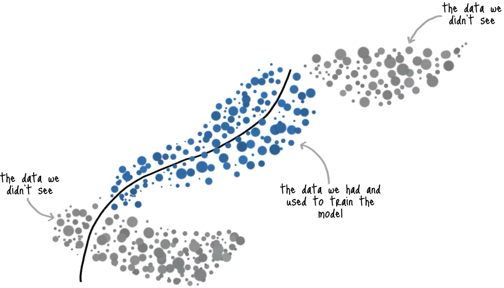{.fragment .fade-in-then-out width="70%"}

:::

## [Data drift | Cómo se observa en el tiempo?]{.big-par}

::: {.r-stack fragment-index=2 .center}

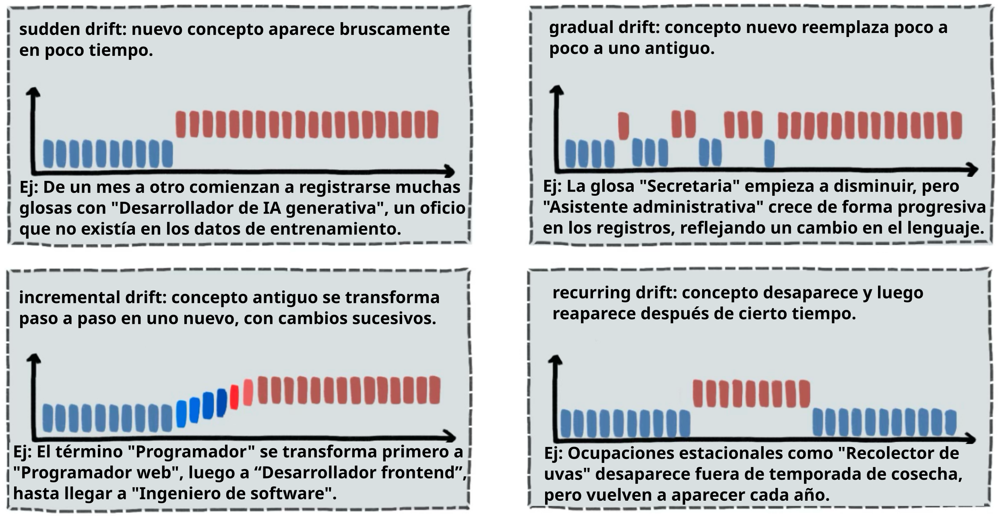{.fragment .fade-in-then-out width="100%"}

:::

## [Data drift | Principales tipos]{.big-par}

::: {fragment-index=0 .center}

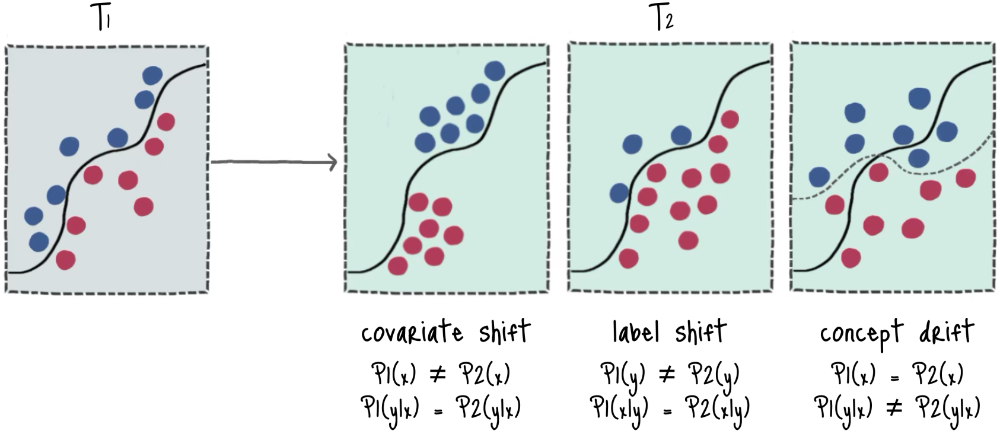{.fragment width="60%"}

:::

::: {.incremental .medium-par}
- **Deriva de covariables** (*Covariate drift*): Ocurre cuando la distribución de las variables de entrada cambia, pero la relación entre estas características y la variable objetivo se mantiene igual.
  - Cambia la forma en que se describen ocupaciones/actividades (lenguaje en las glosas), pero el significado final (etiqueta) se mantiene.
  - Ej: aparecen nuevas palabras como programar, diseñar, gestionar en línea, pero esas descripciones siguen correspondiendo a la misma categoría de ocupación (ej: "Ingeniero de software").
:::

## [Data drift | Principales tipos]{.big-par}

::: {fragment-index=0 .center}

{.fragment width="60%"}

:::

::: {.incremental .medium-par}
- **Deriva de etiquetas** (*Label drift*): Sucede cuando la distribución de la variable objetivo cambia, mientras que la relación entre las características de entrada y la variable objetivo permanece constante.
  - Cambian las frecuencias relativas de clases (qué ocupaciones/actividades son más comunes), aunque la correspondencia entrada → salida se mantiene.
  - Ej: aunque las descripciones de los registros se mantengan estables, cada vez aparecen más casos etiquetados como ocupaciones de "Tecnología" y menos de "Administración".
:::

## [Data drift | Principales tipos]{.big-par}

::: {fragment-index=0 .center}

{.fragment width="60%"}

:::

::: {.incremental .medium-par}
- **Deriva de concepto** (*Concept drift*): Se produce cuando la relación entre las características de entrada y la variable objetivo varía debido a que los supuestos del modelo ya no son válidos.
  - cambia la relación entrada → salida, porque los términos empiezan a usarse para otros conceptos.
  - Ej: si se decide que una palabra que estaba asociada a la clase X comienza a asociarse a la clase Y.
:::

## [Arquitectura | Esquema General]{.big-par}

::: {.r-stack fragment-index=2 .center}

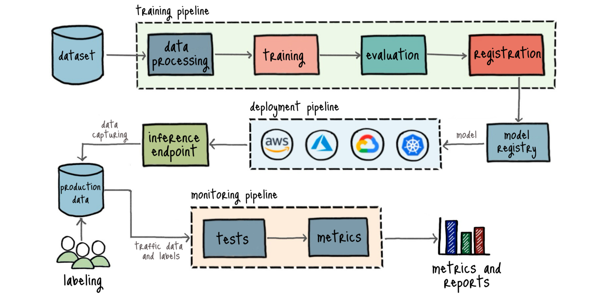{.fragment .fade-in-then-out width="100%"}

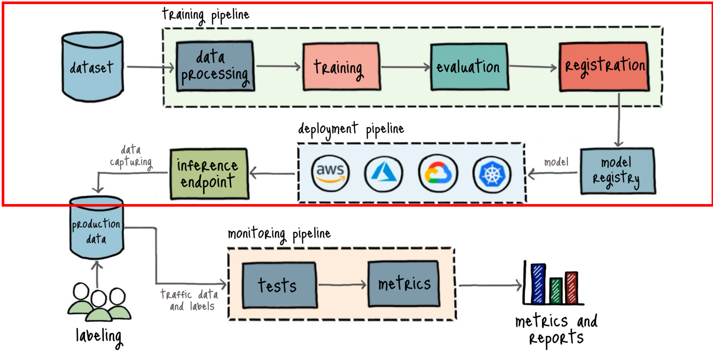{.fragment .fade-in-then-out width="100%"}

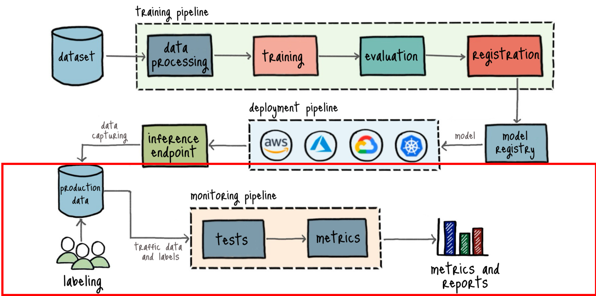{.fragment .fade-in-then-out width="100%"}

:::

## [Arquitectura | Model training]{.big-par}

::: {.incremental .medium-par}
- Los modelos disponibilizados fueron entrenados en Pytorch utilizando una arquitectura **RNN: multi-layer gated recurrent unit (GRU)**. 
- Para mejorar el aprendizaje del modelo, se agregó una capa preliminar que incluye [word embeddings](https://github.com/dccuchile/spanish-word-embeddings/) pre-entrenados.
  - Los embeddings son representaciones de palabras como vectores numéricos, que permiten modelar la relación semántica entre palabras.
  - Los embeddings capturan la relación entre palabras en las glosas de entrenamiento, lo que aumenta la capacidad de aprendizaje del modelo.
<!-- - Modelo disponibilizado a través de una API creada en FastAPI. -->
- Métricas obtenidas:
:::

::: {.r-stack fragment-index=2 .center}

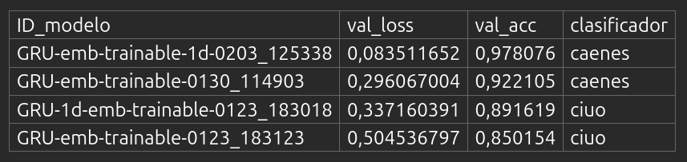{.fragment .fade-in-then-out width="80%"}

:::

## [Arquitectura | Model prediction]{.big-par}

::: {.r-stack fragment-index=2 .center}

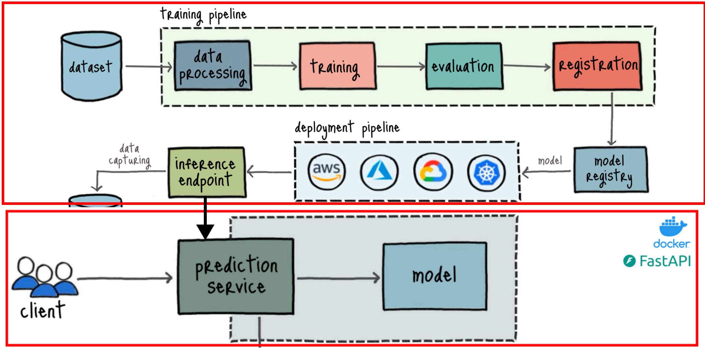{.fragment .fade-in-then-out width="100%"}

:::

## [Arquitectura | Model prediction]{.big-par}

::: {.r-stack fragment-index=2 .center}

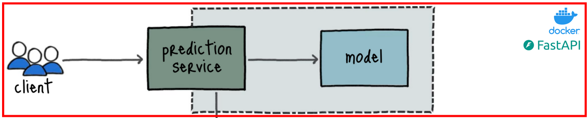{.fragment width="90%"}

:::

::: {.r-stack fragment-index=2 .center}

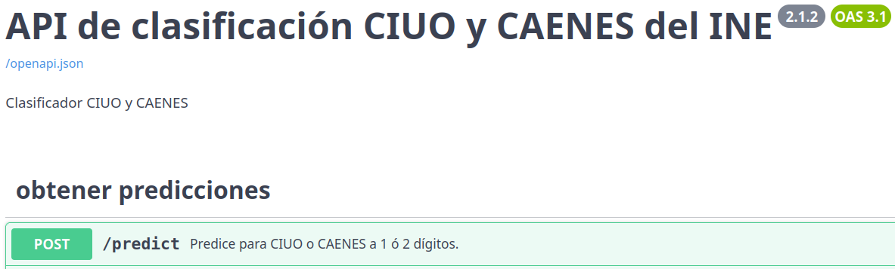{.fragment width="70%"}

:::

::: {.r-stack fragment-index=2 .center}

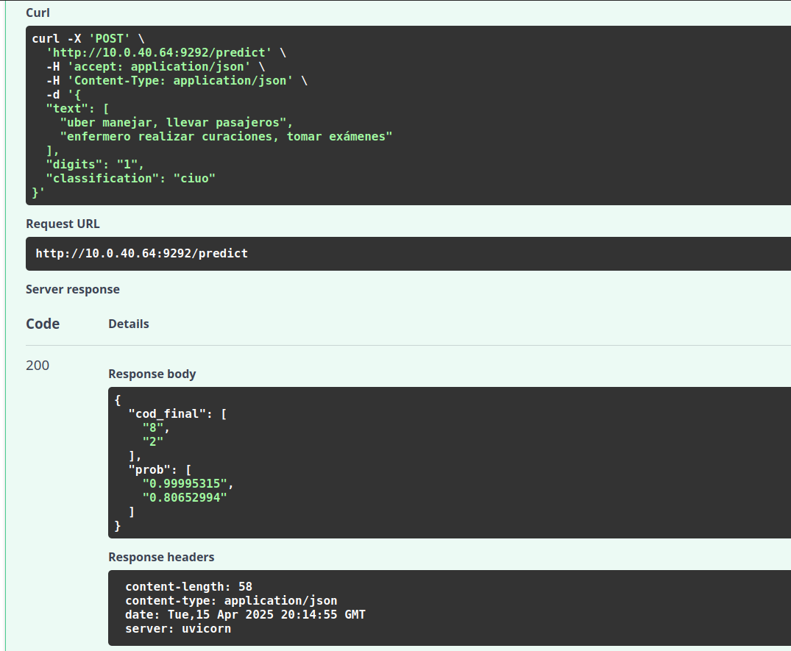{.fragment width="70%"}

:::

## [Arquitectura | Model monitoring]{.big-par}

::: {.r-stack fragment-index=2 .center}

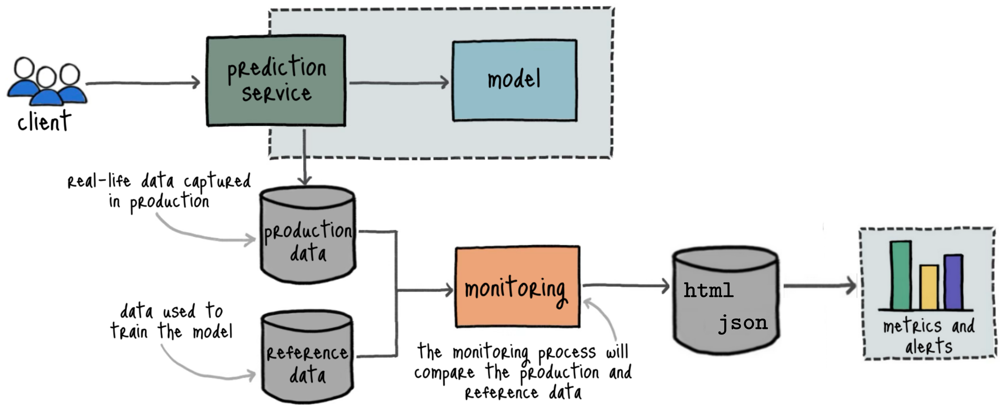{.fragment .fade-in-then-out width="100%"}

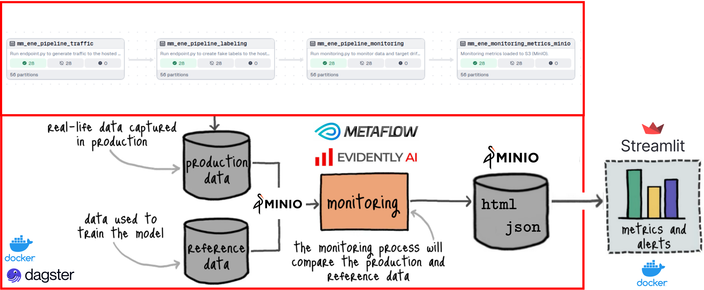{.fragment .fade-in-then-out width="100%"}

:::

## [Arquitectura | Model monitoring | Data capture]{.big-par}

::: {.r-stack fragment-index=2 .center}

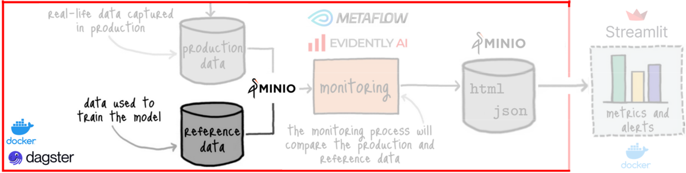{.fragment width="50%"}

:::

::: {.r-stack fragment-index=2 .center}

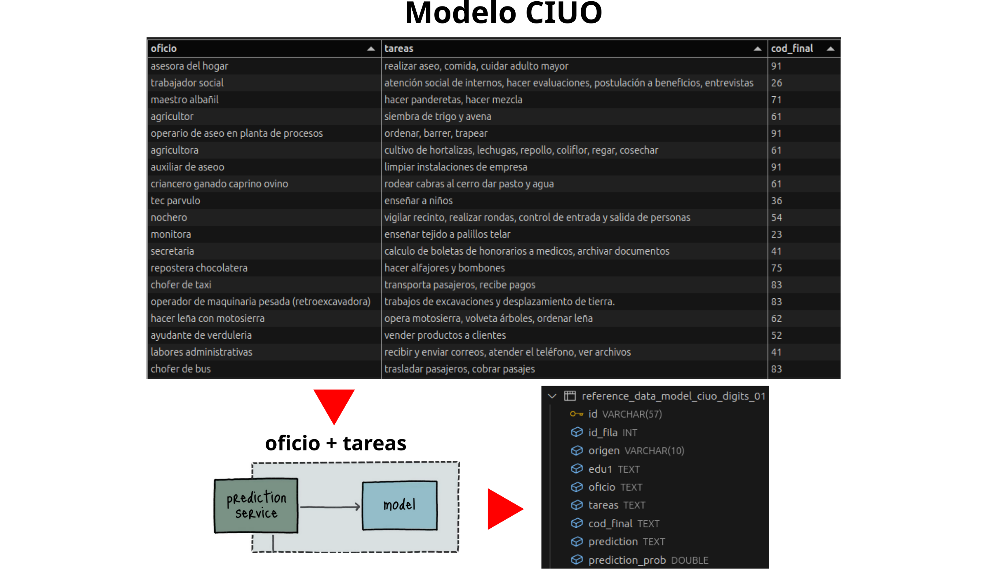{.fragment .fade-in-then-out width="100%"}

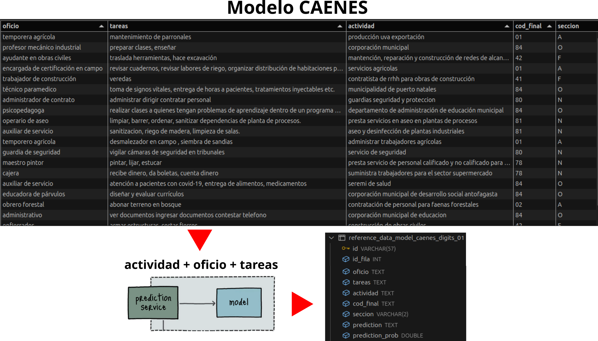{.fragment .fade-in-then-out width="100%"}

:::

## [Arquitectura | Model monitoring | Data capture]{.big-par}

::: {.r-stack fragment-index=2 .center}

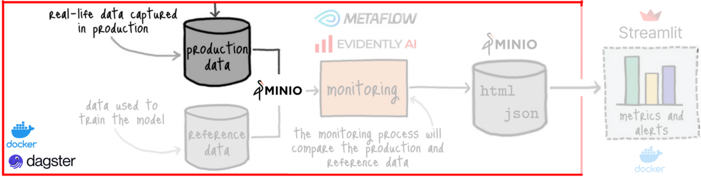{.fragment width="50%"}

:::

::: {.r-stack fragment-index=2 .center}

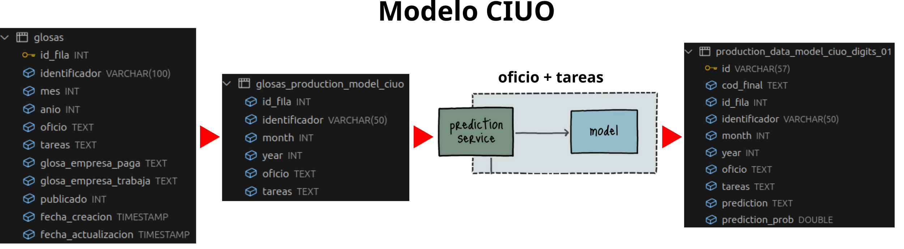{.fragment .fade-in-then-out width="100%"}

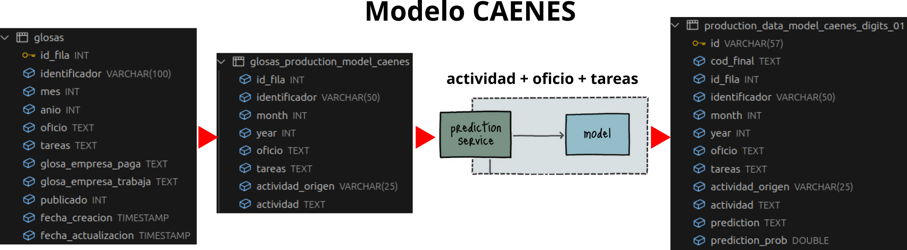{.fragment .fade-in-then-out width="100%"}

:::

## [Arquitectura | Model monitoring | Metrics]{.big-par}

::: {.r-stack fragment-index=2 .center}

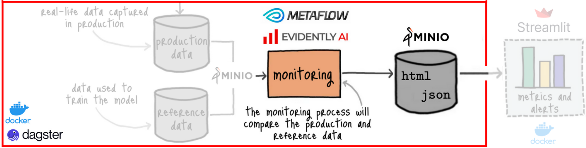{.fragment width="50%"}

:::

::: {.incremental .medium-par}
- **Comparamos los dataset de producción (coyuntura) y de referencia (entrenamiento) aplicando múltiples métricas de drift**:
  - Algunas implementadas por la librería open-source [Evidently](https://docs.evidentlyai.com/metrics/customize_data_drift).
    - a nivel de cada clase (predicción / ground truth) y dataset.
  - Otras implementadas a medida, como proxy para estimar la incerteza y novedad de los registros.
    - a nivel de cada registro.
- **Combinando las diferentes métricas obtenidas, calculamos una métrica única**.
    - nos permite seleccionar un subconjunto de registros para ser enviado a revisión.
- Las diferentes métricas calculadas se almacenan en **MinIO** como archivos **html, json, parquet**.
:::

## [Arquitectura | Model monitoring | Metrics]{.big-par}

<!-- ::: {.small-par}

| Test / Report                      | Evaluación | Nivel |
|:-----------------------------------|:------------|:------------|
| Test Suite                         | checks generales sobre columnas **oficio, tareas y actividad **(sólo CAENES)      |  dataset    |
| Report Text Summary                | estadísticas generales (mean, std, etc.) sobre los descriptores **Text Length** y **Word Count** aplicados sobre las columnas **oficio, tareas y actividad **(sólo CAENES). | dataset |
| Report Text Drift                  | drift sobre los descriptores **Text Length** y **Word Count** aplicados a las columnas **oficio, tareas y actividad** (sólo CAENES).   - **Text Length**: largo del texto en caracteres.    - **Word Count**: número de palabras en el texto. | clase + dataset |
| Report Embedding Drift             | drift en los **embeddings obtenidos para el dataset de producción y referencia**, a partir de los mismos word embeddings pre-entrenados usados en el entrenamiento del modelo. |  clase + dataset |
| Report Prediction Drift            | drift en las **clases predichas por del modelo**. | dataset |
| Report Prediction Drift vs Truth   | drift en las **clases predichas por del modelo en el dataset de producción** vs **classes verdaderas en el dataset de referencia**. | dataset |
| Report Prediction Class Prob Drift | drift en las **probabilidades de las clases predichas por del modelo**. |  clase + dataset |
| Report Drift Priority | priority score basado en **incerteza y novedad de las glosas**. | registro |
: {tbl-colwidths="[25,55,20]"}

::: -->

::: {.small-par}

| Report                      | Evaluación | Nivel |
|:-----------------------------------|:------------|:------------|
| Text Drift                  | drift sobre los descriptores **Text Length** y **Word Count** aplicados a las columnas **oficio, tareas y actividad** (sólo CAENES).   - **Text Length**: largo del texto en caracteres.    - **Word Count**: número de palabras en el texto. | clase, dataset |
| Embedding Drift             | drift en los **embeddings obtenidos para el dataset de producción y referencia**, a partir de los mismos word embeddings pre-entrenados usados en el entrenamiento del modelo. |  clase, dataset |
| Prediction Drift            | drift en las **clases predichas por el modelo**. | dataset |
| Prediction Drift vs Truth   | drift en las **clases predichas por el modelo en el dataset de producción** vs **classes verdaderas en el dataset de referencia**. | dataset |
| Prediction Class Prob Drift | drift en las **probabilidades de las clases predichas por el modelo**. |  clase, dataset |
| Record Drift | drift basado en **incerteza y novedad de las glosas**. | registro |
: {tbl-colwidths="[25,55,20]"}

:::

## [Arquitectura | Model monitoring | Metrics]{.big-par}

::: {.small-par}

| Report                      | Métrica para evaluar drift | Rango | Threshold | 
|:-|:-|:-|:-|
| Text Drift                  | - **Wasserstein distance**: modelos a 1 dígito.   - **Kolmogorov–Smirnov (K-S) test**: modelos a 2 dígitos. |  [0, +inf]   [0, 1] | drift ≥ 0.1   drift < 0.05
| Embedding Drift             | - **Binary classifier** para distinguir entre los embeddings calculados desde ambos datasets.   - Retorna valores de **ROC AUC como *drift_score***. | [0, 1] | drift > 0.55
| Prediction Drift            | - **Jensen-Shannon distance**. | [0, 1] | drift ≥ 0.1
| Prediction Drift vs Truth   | - **Jensen-Shannon distance**. | [0, 1] | drift ≥ 0.1 
| Prediction Class Prob Drift | - **Wasserstein distance**: modelos a 1 dígito.   - **Kolmogorov–Smirnov (K-S) test**: modelos a 2 dígitos. |   [0, +inf]   [0, 1] | drift ≥ 0.1   drift < 0.05
| Record Drift | - uncertainty_score_norm   - novelty_score_norm | [0, 1]   [0, 1] | 
: {tbl-colwidths="[25,50,10,15]"}

:::

## [Arquitectura | Model monitoring | Metrics]{.big-par}

::: {.incremental .medium-par}
- **Cómo calculamos una única métrica a partir de las múltiples métricas aplicadas?**
  - Usamos sumas ponderadas para combinar las métricas obtenidas a distintos niveles (registro, clase, dataset) y luego para obtener una métrica final de revisión.
- **Record drift score:**
  - Suma ponderada de métricas a nivel de registro:   uncertainty_score_norm, novelty_score_norm.
- **Class drift score:**
  - Suma ponderada de métricas a nivel de clase y dataset normalizadas (entre 0 y 1):   drift en descriptores de texto, embeddings, clases predichas, clases predichas vs verdaderas, probabilidades de las clases predichas.
- **Revision score:**
  - Suma ponderada de **record_drift_score** y **class_drift_score**.
  - Nos permite seleccionar qué registros del periodo analizado (coyuntura) es importante revisar.
:::

<!-- ::: {.r-stack fragment-index=2 .center}

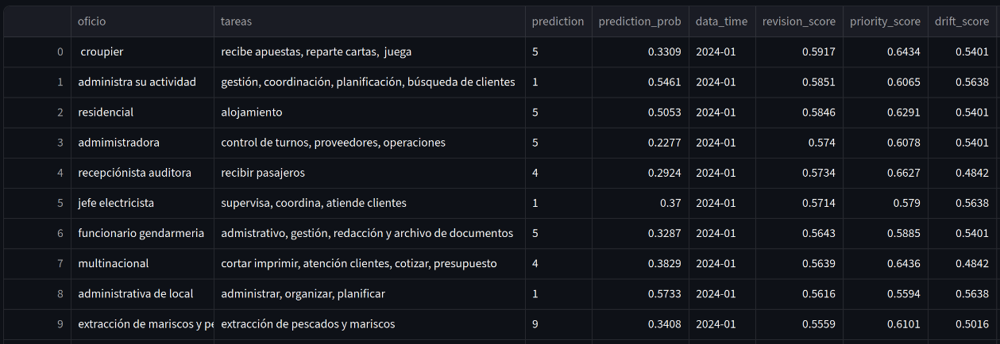{.fragment width="90%"}

::: -->

## [Arquitectura | Model monitoring | Metrics]{.big-par}

::: {.small-par}

| Metric | W | Metric | W | Metric
|:-|:-|:-|:-|:-|
| uncertainty_score_norm   novelty_score_norm | 0.5   0.5 |   **record_drift_score** |   0.5 
| delta_drift_score_length_oficio_class_norm   delta_drift_score_length_tareas_class_norm   delta_drift_score_wordcount_oficio_class_norm   delta_drift_score_wordcount_tareas_class_norm   delta_drift_score_small_embeddings_class_norm   delta_drift_score_big_embeddings_class_norm   delta_drift_score_prediction_class_probs_class_norm   delta_drift_score_length_oficio_global_norm   delta_drift_score_length_tareas_global_norm   delta_drift_score_wordcount_oficio_global_norm   delta_drift_score_wordcount_tareas_global_norm   delta_drift_score_small_embeddings_global_norm   delta_drift_score_big_embeddings_global_norm   delta_drift_score_prediction_global_norm   delta_drift_score_prediction_vs_truth_global_norm   delta_drift_score_prediction_class_probs_global_norm | 0.08   0.08   0.08   0.08   0.08   0.08   0.08   0.04   0.04   0.04   0.04   0.04   0.04   0.04   0.04   0.04 |                 **class_drift_score** |                 0.5 |                 **revision_score**
: {tbl-colwidths="[52,8,16,8,16]"}

:::

## [Arquitectura | Model monitoring | Revision]{.big-par}

::: {.incremental .medium-par}
- **Cómo validamos las métricas que calculamos?**
  - Seleccionamos un subconjunto de registros para cada periodo de interés (ej: coyunturas) para ser revisado por analistas expertos.
  - Criterios utilizados en cada selección:
    - Contiene registros observados en los valores más altos y más bajos del **revision_score** en el periodo, ordenados aleatoriamente.
    - Su distribución de clases (predichas) es la misma que en el dataset de producción del periodo.
    - Pensamos en ~100 registros por coyuntura.
:::

## [Arquitectura | Model monitoring | Revision]{.big-par}

::: {.incremental .medium-par}
- **¿Cómo validamos las métricas que calculamos?**
  - Colaboración de analistas:
    - Dos analistas clasificarían el mismo subconjunto de registros seleccionados.
      - Permite contar con una clasificación independiente.
    - Los analistas además responderían un par de preguntas que nos permitirán evaluar la **complejidad** y **novedad** de los registros, a partir de su conocimiento experto.
      - **Q1. En relación al tiempo que se tarda usualmente en codificar un registro, este registro le tomó:**
        - 1: Menos tiempo.
        - 2: Aproximadamente el mismo tiempo.
        - 3: Más tiempo.
      - **Q2. ¿Considerando su experiencia codificando, qué tan parecido considera este registro a alguno que haya visto en el pasado?**
        - 1: Muy parecido. He visto muchas glosas similares en el pasado.
        - *2: Algo parecido. He visto pocas glosas similares en el pasado.*
        - 3: Muy distinto. Nunca había visto una glosa similar en el pasado.
    - Podemos compartir los registros seleccionados junto a las preguntas extra en un [formato familiar](https://nomenclatura-dev.ine.cl/) para el equipo de Nomenclaturas.
:::

::: {.r-stack fragment-index=2 .center}

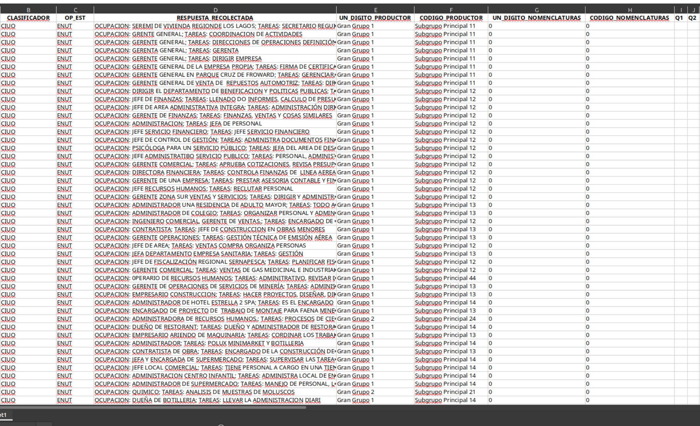{.fragment .fade-in-then-out width="100%"}

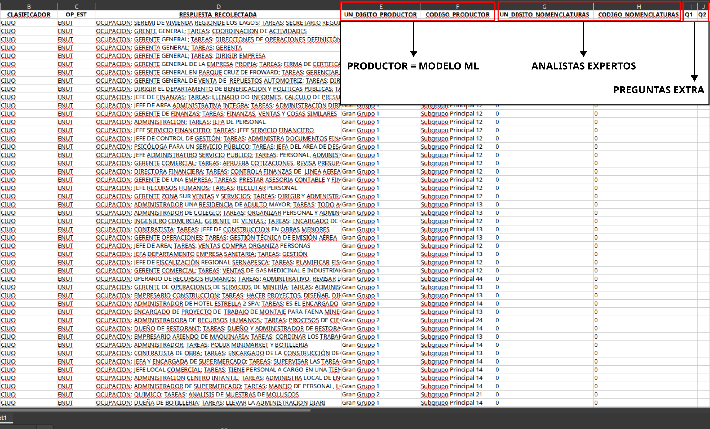{.fragment .fade-in-then-out width="100%"}

:::

## [Arquitectura | Model monitoring | Revision]{.big-par}

::: {.incremental .medium-par}
- **Cómo validamos las métricas que calculamos?**
  - Validación de métricas:
    - Analizaremos cómo se correlacionan la clasificación y la estimación de complejidad y novedad de analistas con nuestras métricas.
    - Evaluaremos cómo evoluciona en el tiempo la performance de los modelos en base a la clasificación realizada por analistas.
      - A partir de dicha evaluación, podremos estimar la frecuencia con que sería conveniente re-entrenar los modelos.
:::

<!-- ## [Trabajo futuro / Discusión]{.big-par}

::: {.incremental .medium-par}
- De los resultados obtenidos hasta el momento, vemos evidencia de data drift en:
  - CIUO para **Text Length** y **Word Count** de columna **tareas**.
    - Significativo para considerar reentrenar el modelo? 
  - CAENES para **Text Length** y **Word Count** de columna **tareas**, pero también para los **Embeddings**.
    - Caso más significativo, ya que la relación semántica de las palabras en las glosas puede haber cambiado. 
  - De todas maneras, podemos realizar tests adicionales con otras métricas para confirmar los resultados y decidir si conviene reentrenar los modelos. 
- Intentar obtener etiquetas de una muestra del dataset de producción, para así evaluar la peformance de los modelos en el tiempo (accuracy, etc). 
- Integrar a la arquitectura el re-entrenamiento de modelos.
  - Sujeto a criterios basados en los resultados obtenidos para las métricas de monitoreo. 
::: -->

<!-- ## [Arquitectura de Monitoreo | Model monitoring | Metrics]{.big-par}

::: {.r-stack fragment-index=2 .center}

{.fragment width="50%"}

:::

::: {.incremental .medium-par}
- Los resultados entregados por Evidently se exportan como **HTML, JSON, etc** y almacenan en **MinIO**.
:::

::: {.r-stack fragment-index=2 .center}

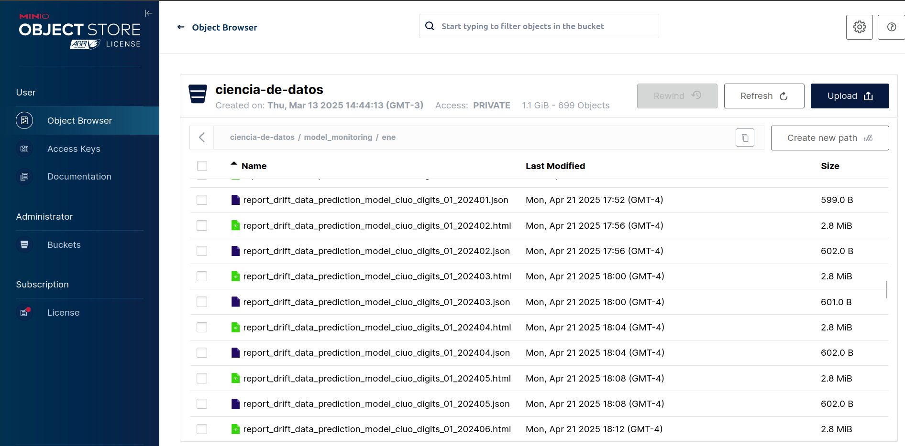{.fragment width="80%"}

::: -->

<!-- ## [Arquitectura de Monitoreo | Model monitoring | Metrics]{.big-par}

::: {.incremental .medium-par}
- Test Suite
:::

::: {.r-stack fragment-index=2 .center}

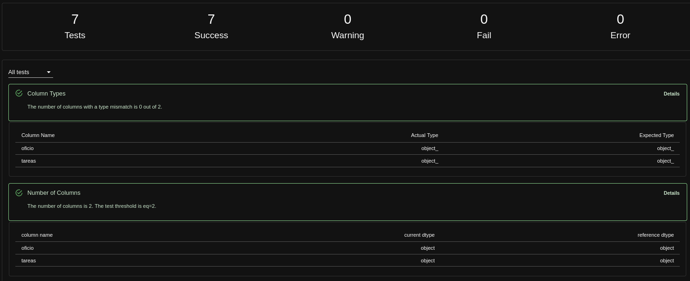{.fragment width="100%"}

::: -->

<!-- ## [Arquitectura de Monitoreo | Model monitoring | Metrics]{.big-par}

::: {.incremental .medium-par}
- Report Quality Summary
:::

::: {.r-stack fragment-index=2 .center}

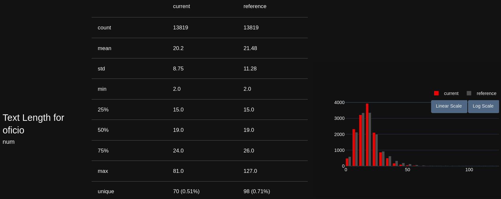{.fragment width="100%"}

::: -->

<!-- ## [Arquitectura de Monitoreo | Model monitoring | Metrics]{.big-par}

::: {.incremental .medium-par}
- Report Quality Drift
:::

::: {.r-stack fragment-index=2 .center}

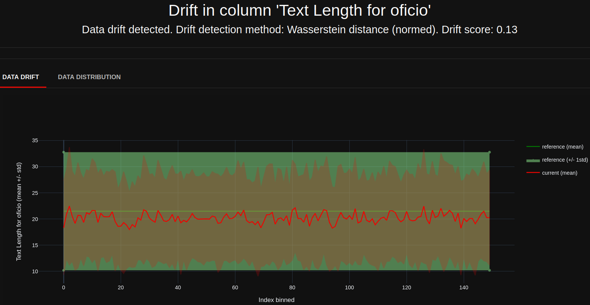{.fragment width="100%"}

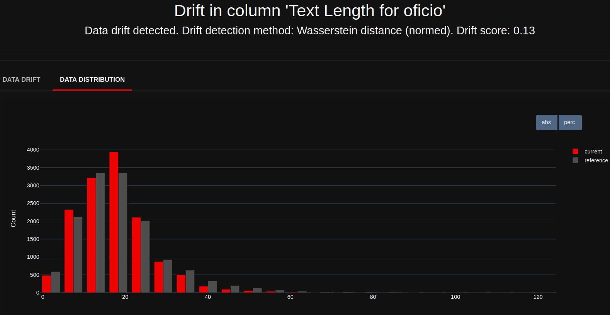{.fragment width="100%"}

::: -->

<!-- ## [Arquitectura de Monitoreo | Model monitoring | Metrics]{.big-par}

::: {.incremental .medium-par}
- Report Embedding Drift
:::

::: {.r-stack fragment-index=2 .center}

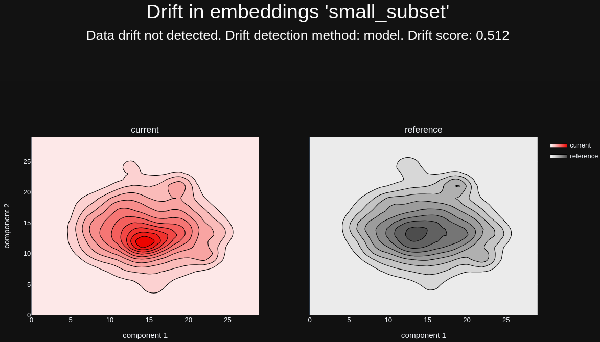{.fragment width="80%"}

::: -->

## [Arquitectura | Dashboard]{.big-par}

::: {.r-stack fragment-index=2 .center}

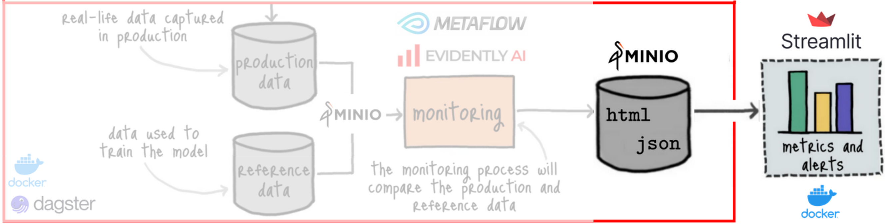{.fragment width="50%"}

:::

::: {.r-stack fragment-index=2 .center}

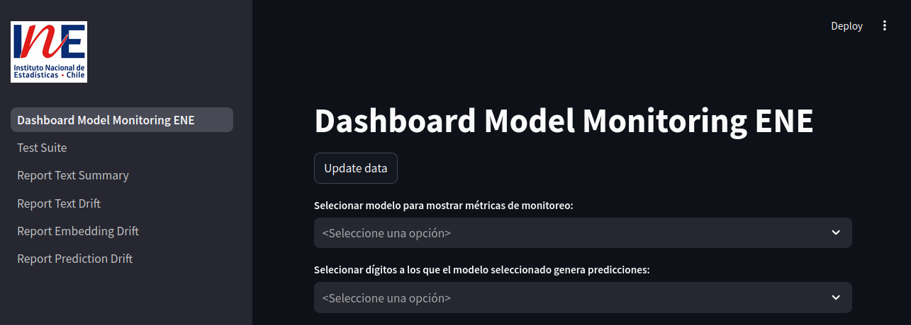{.fragment width="80%"}

:::

. . .

::: {.center}
[Veamos el dashboard](http://10.90.10.60:8050/)
:::

#

[]{.center}

[**Monitoreo de Modelos de Clasificación de Texto**]{.big-par .center-justified}
[**Ciencia de Datos**]{.medium-par.center-justified}

[**Agosto 2025**]{.big-par .center-justified}

[]{.linea-superior} 
[]{.linea-inferior} 

## [Apéndice | Metrics]{.big-par}

::: {.incremental .medium-par}
- **1) Wasserstein distance**: 
- La usamos en **Text Drift** y **Prediction Class Prob Drift**, para modelos a 1 dígitos.
- Mide la distancia entre dos distribuciones de probabilidad, calculando la cantidad mínima de *trabajo* requerido para transformar una distribución en otra.
    - *Trabajo* se refiere al costo de mover una unidad de masa de probabilidad.
  - *drift_score* en rango [0, +inf]:
    - 0 indica que las dos distribuciones son idénticas.
    - *> threshold* es indicativo de drift. Por defecto *threshold = 0.1*
:::

## [Apéndice | Metrics]{.big-par}

::: {.incremental .medium-par}
- **1) Wasserstein distance**: estimación.
:::

::: {.r-stack fragment-index=2 .center layout-ncol=2}

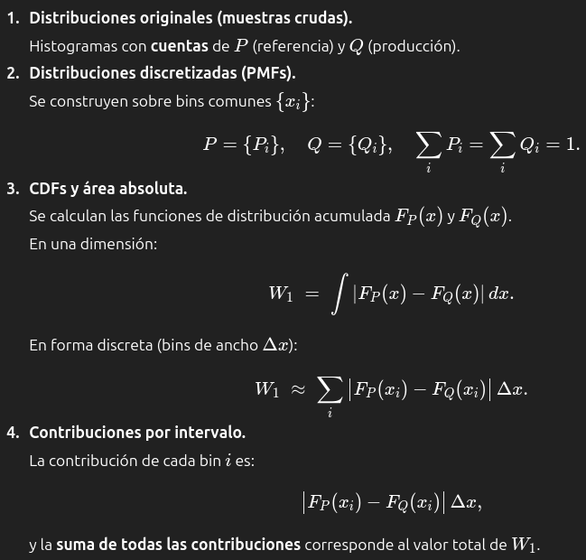{.fragment width="60%"}

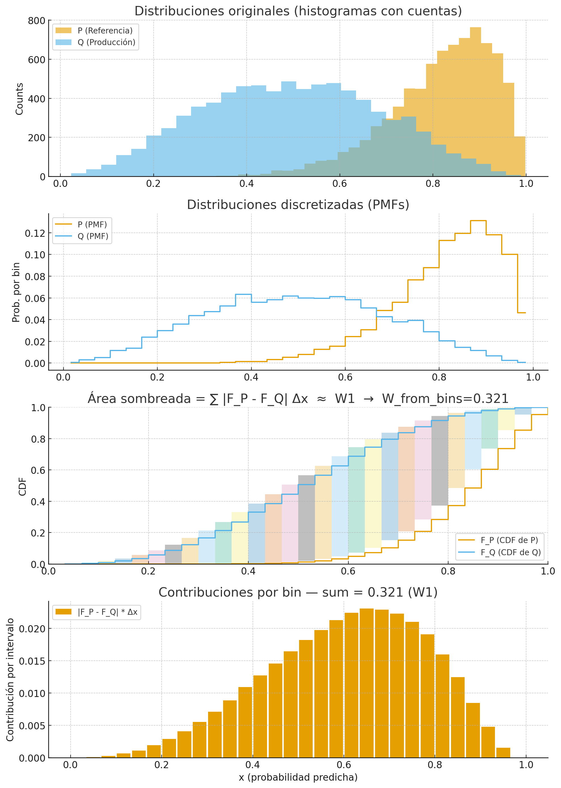{.fragment width="60%"}

:::

## [Apéndice | Metrics]{.big-par}

::: {.incremental .medium-par}
- **2) Kolmogorov–Smirnov (K-S) test**: 
- La usamos en **Text Drift** y **Prediction Class Prob Drift**, para modelos a 2 dígitos.
- Es una prueba estadística no paramétrica: no asume una distribución específica de los datos (ejemplo: normal u otra).
  - Construye distribuciones de probabilidad acumulada (CDFs).
  - Evalúa la máxima diferencia absoluta entre ambas CDFs y ese valor se usa como estadístico de prueba.
  - La hipótesis nula es que las dos muestras vienen de la misma distribución y la prueba se aplica para rechazar o aceptar esta hipótesis.
  - Retorna *p_value* en rango [0, 1]. 
    - Si *p_value < 0.05*, usualmente podemos declarar que hay evidencia para rechazar la hipótesis nula y considerar que las dos muestras son diferentes, es decir, que existe drift.
:::

## [Apéndice | Metrics]{.big-par}

::: {.incremental .medium-par}
- **2) Kolmogorov–Smirnov (K-S) test**: estimación.
:::

::: {.r-stack fragment-index=2 .center layout-ncol=2}

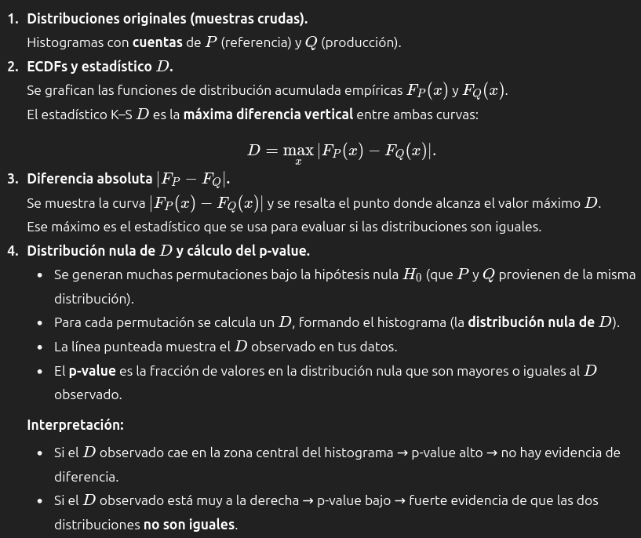{.fragment width="50%"}

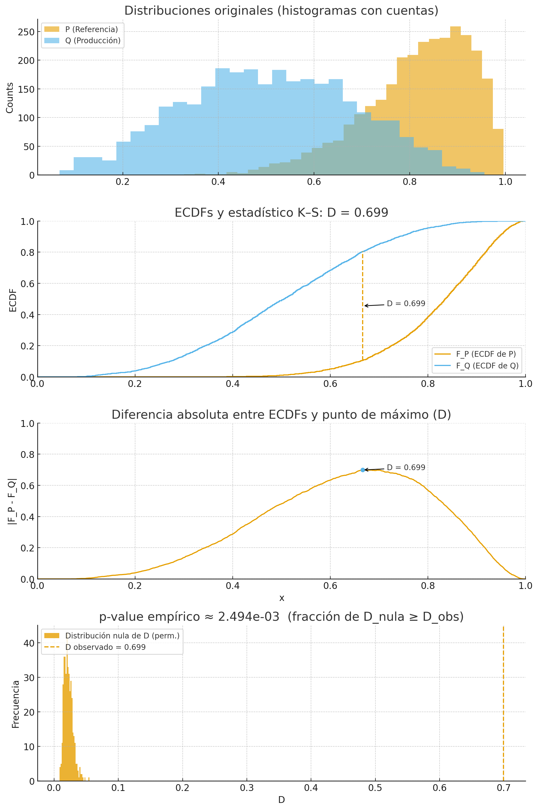{.fragment width="50%"}

:::

## [Apéndice | Metrics]{.big-par}

::: {.incremental .medium-par}
- **3) Jensen-Shannon distance**:
- La usamos en **Prediction Drift** y **Prediction Drift vs Truth**, para modelos a 1 y 2 dígitos.
- Basada en el método **Kullback-Leibler Divergence**, mide la distancia entre dos distribuciones de probabilidad calculando la raíz cuadrada de la **Jensen-Shannon divergence**.
    - *drift_score* en rango [0, 1]:
      - 0 indica que las dos distribuciones son idénticas.
      - *> threshold* es indicativo de data drift. Por defecto *threshold = 0.1*
:::

## [Apéndice | Metrics]{.big-par}

::: {.incremental .medium-par}
- **3) Jensen-Shannon distance**: estimación.
:::

::: {.r-stack fragment-index=2 .center layout-ncol=2}

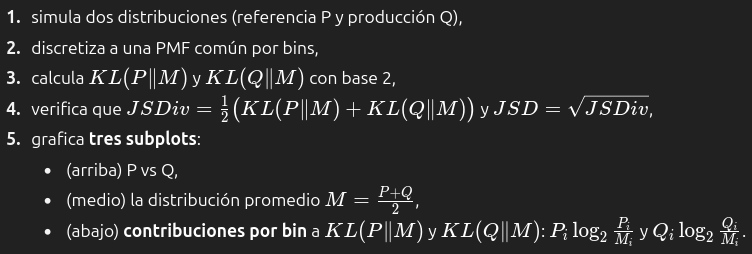{.fragment width="70%"}

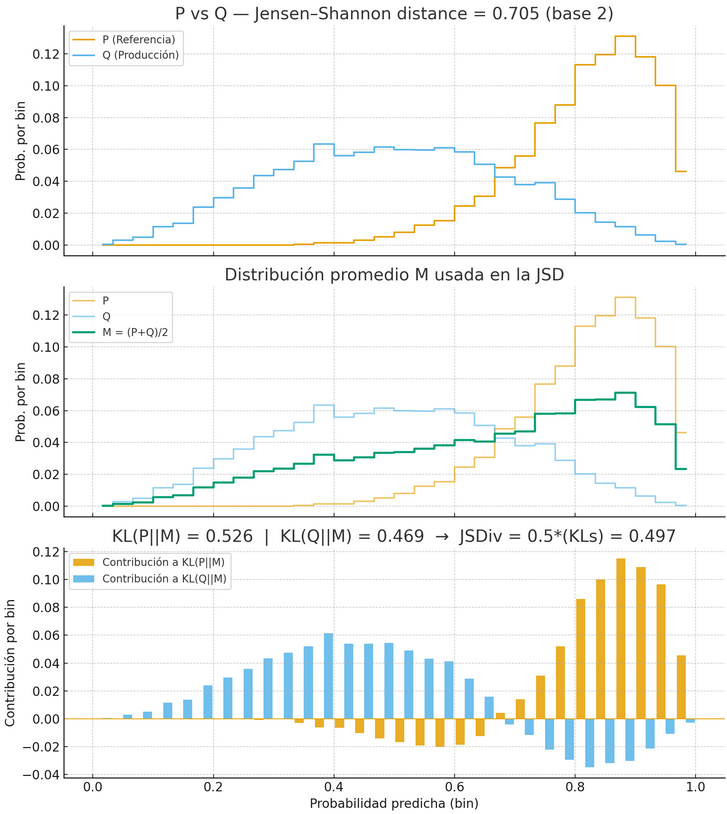{.fragment width="70%"}

:::

## [Apéndice | Metrics]{.big-par}

::: {.incremental .medium-par}
- **4) Binary Classifier** 
- Lo usamos en **Embedding Drift** (modelos a 1 y 2 dígitos).
- Este clasificador retorna valores de **ROC AUC como *drift_score***.
  - *drift_score* en rango [0, 1].
  - *> threshold* es indicativo de data drift. Por defecto *threshold = 0.55*
:::

::: {.r-stack fragment-index=2 .center}

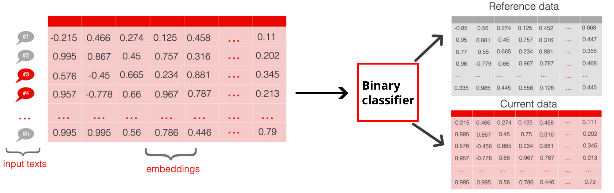{.fragment .fade-in-then-out width="90%"}

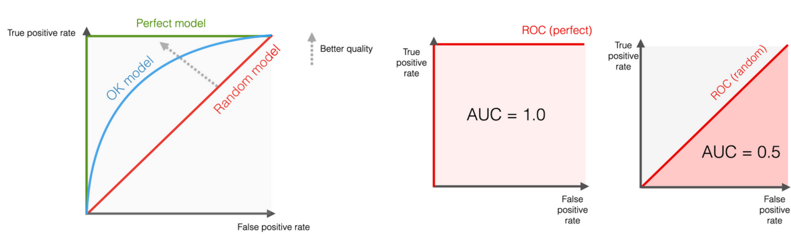{.fragment width="90%"}

:::

## [Apéndice | Metrics]{.big-par}

::: {.incremental .medium-par}
- **5) Record Drift:** 
  - **Uncertainty score:** Es una medida de la baja confianza de los registros del dataset de producción, estimada en base a las probabilidades de predicción del modelo.
  $$
  \small uncertainty\_score = 1 - prediction\_probability
  $$
  - **Novelty score:** Es una medida de la diferencia semántica entre registros del dataset de producción y referencia.   Combina similitud coseno y la mínima distancia euclidiana normalizada calculadas para cada embedding del dataset de producción respecto a todos los embeddings del dataset de referencia.
  $$
  \small novelty\_score = \frac{(1 - max\_cosine\_similarity + min\_euclidean\_distance\_norm)}{2}
  $$
  <!-- - **Diversity score:** Representa la diversidad de los registros en el dataset de producción. Se calcula en base a K-Means clustering, midiendo la distancia de cada registro a su centro de cluster más cercano: 
    1. Aplicar K-Means clustering a los embeddings de los registros de producción.
    2. Para cada registro, calcular distancia euclidiana a su centroide. -->
  - **Record drift score:**
    - Se normalizan las tres métricas anteriores usando la fórmula:   
    $$
    \small
    metric\_norm = \frac{metric - min(metric)}{max(metric) - min(metric)}
    $$
    - Luego usamos las métricas normalizadas para calcular:
    $$
    \small record\_drift_\_score = w_1 \times uncertainty\_score\_norm \\ 
    \small \hspace{4.cm} + w_2 \times novelty\_score\_norm
    $$
    - donde usamos por defecto los pesos: 
    $$ \small w_1=0.5, w_2=0.5 $$
:::

